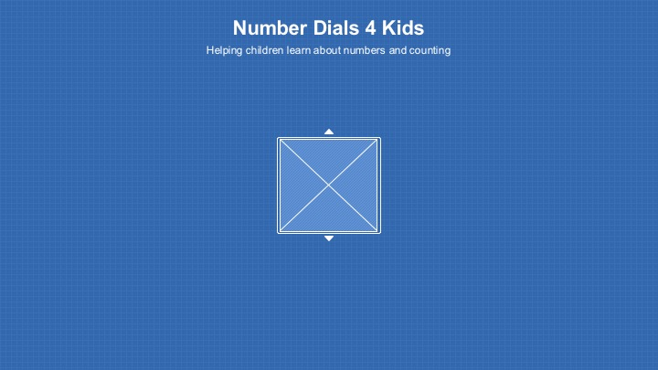

# Number Dials 4 Kids
A simple user interface for children to learn basics about numbers and their relationships.

## Overview
Number Dials 4 Kids is an exercise in basic Angular web app development intended to help the author explore Angular web app development within a limited but practical scope. Number Dials 4 Kids implements a simple user interface for children to learn basics about numbers and their step-wise relationships by incrementing and decrementing number dials, each representing a single digit within an arbitrary positive decimal integer of one or more digits of the child's choosing. By automating certain numeric relationships (e.g., adding a digit when incrementing from "9" to "10") or constraining others (e.g., require all right-hand digits to be "9" before a left-hand "1" can be rotated away), it is expected that the child can learn about numbers in a simple and engaging way.

## Number Dial control
A number dial is a UI control representing a single-digit decimal number from 0..9 inclusive. Swiping up rotates the number dial up (e.g., from "1" to "2") and swiping down rotates the number dial down (e.g., from "2" to "1"). There are equivalent "tap up" and "tap down" controls immediately above and below each number which do the same. 

## Number Dials collection
A number dials collection is stack of number dial controls representing an arbitrary positive decimal integer. There is always at least one number dial on the stack and additional number dial controls can be pushed and popped. The top of the stack represent left-hand digits of the represented number and the bottom of the stack represents right-hand digits.

### Number Dial Rules
- When all number dials on the stack are at "9", then rotating the left-most number dial above "9" pushes a new number dial onto the stack, initialized to "1", and rotates all other number dials to "0".
- Similarly, when all other number dials on the stack are "0", then rotating the left-most number dial below "1" removes that number dial and rotates all other number dials to "9". 

## User Experience
Upon launching the app, the child is presented with a single number dial (one item on the stack) initialized to "1". The child can rotate this dial freely, including above "9" which adds a second number dial representing a 10s column. The child is free to explore numbers in this manner consistent with the rules of the number dials collection described above.

## Mockups

## Navigation
This is a single view application: there is no navigation between pages. That said, number dials are added or removed as described above.

## References
